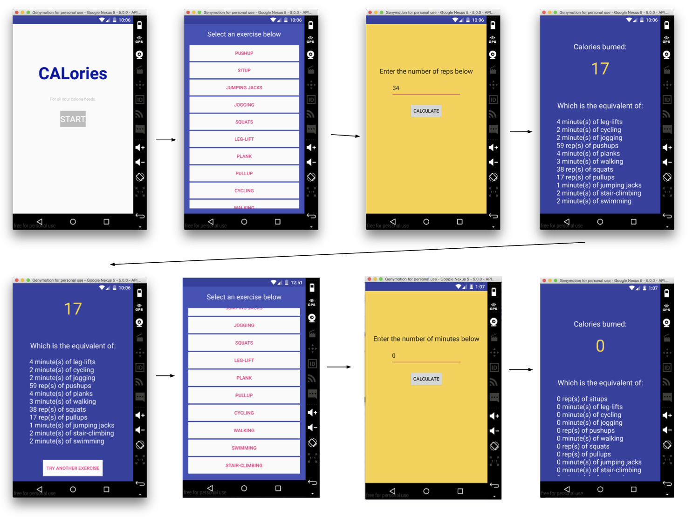

# PROG 01: Crunch Time

PROG 01 for CS 160: User Interface Designs at UC Berkeley. This is a basic calorie converter app that takes in a given exercise and a number of minutes or repitions (depending on the exercise) and then tells you how many calories you would burn and how many of the other given exercises you would need to do to burn that number of calories. This assumes a person of about 150 pounds.

*<strong> The apk files are in the root directory in a folder called APK_FILES </strong>*

## Authors

Patrick O'Halloran ([pohalloran@berkeley.edu](mailto:pohalloran@berkeley.edu))

## Demo Video

See CALories here: (https://youtu.be/XNxRzLSrv7Q)

## Screenshots

## Acknowledgments

* Thank you StackOverflow
